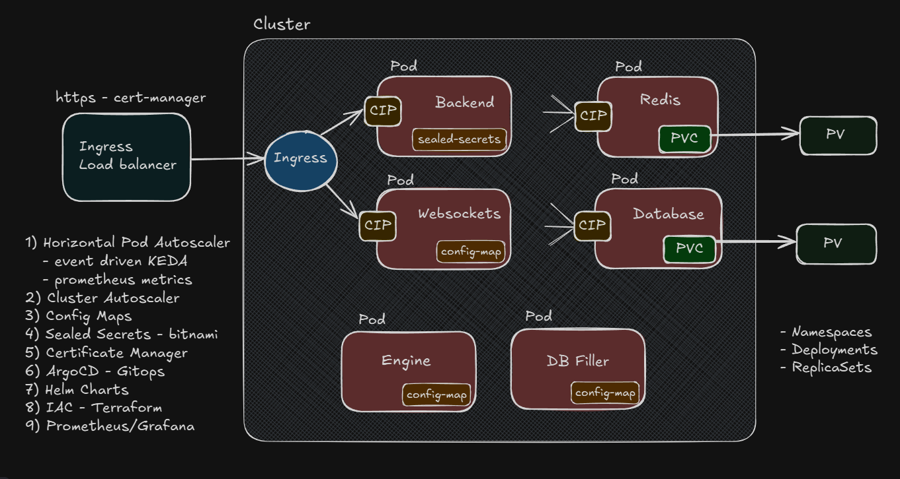

# 🚀 Kubernetes Exchange Cluster

A bulletproof, production-grade Kubernetes setup hosted on Google Cloud Platform (GCP) built specifically for running modern exchange platforms—secure, scalable, and cloud-native from day one. Whether you're launching a **crypto exchange**, **DeFi app**, or **high-frequency trading platform**, this cluster is designed to keep your services fast, resilient, and secure.

---

## 🧱 Architecture

> Battle-tested components for a modern, composable infrastructure stack:

- 🌐 **NGINX Ingress Controller** – Route traffic intelligently with support for HTTPS, path-based routing, and custom domains
- ⚖️ **Load Balancers** – Ensure high availability and seamless scaling
- 🔐 **Sealed Secrets** ([Bitnami Sealed Secrets](https://github.com/bitnami-labs/sealed-secrets)) – GitOps-friendly secrets encrypted for your cluster
- 🔏 **cert-manager** – Automated TLS certificates via Let’s Encrypt or your own CA
- 💾 **Persistent Volume Claims (PVCs)** – State-safe storage for order books, ledgers, and more
- 📊 **Horizontal Pod Autoscaling (HPA)** – Auto-scale based on CPU/memory or custom metrics
- 🔎 **Observability** – Drop-in support for Prometheus, Grafana, Loki, and other observability stacks
- 🛡️ **Security Best Practices** – sealed secrets, TLS certificates, managed access to storage, and more — all enforced via GitOps workflows and ArgoCD syncs

---

## 🧠 Why This Exists

Running an exchange is about more than just uptime—it's about **security**, **resilience**, and **performance under pressure**. This cluster provides a robust foundation for infrastructure teams aiming to build or scale real-world trading platforms and financial applications.

---

## 📦 Tech Stack

| Layer           | Tooling                     |
| --------------- | --------------------------- |
| Cluster         | Kubernetes (K8s), Helm      |
| Deployment      | ArgoCD GitOps               | 
| Networking      | NGINX Ingress, LoadBalancer |
| Secrets         | Sealed Secrets              |
| Certificates    | cert-manager                |
| Autoscaling     | HPA + Metrics APIs          |
| Storage         | PVCs (EBS, SSD, etc.)       |
| Observability   | Prometheus, Grafana         |
| Optional Addons | Redis, PostgreSQL, Kafka    |

---

## 🛠️ Use Cases

- 🪙 **Crypto / DeFi exchange infrastructure**
- 📈 **High-frequency trading clusters**
- 💸 **Real-time financial applications**
- 🔁 **Scalable Web3 backends**
- 🧪 **Kubernetes experimentation lab**

---
